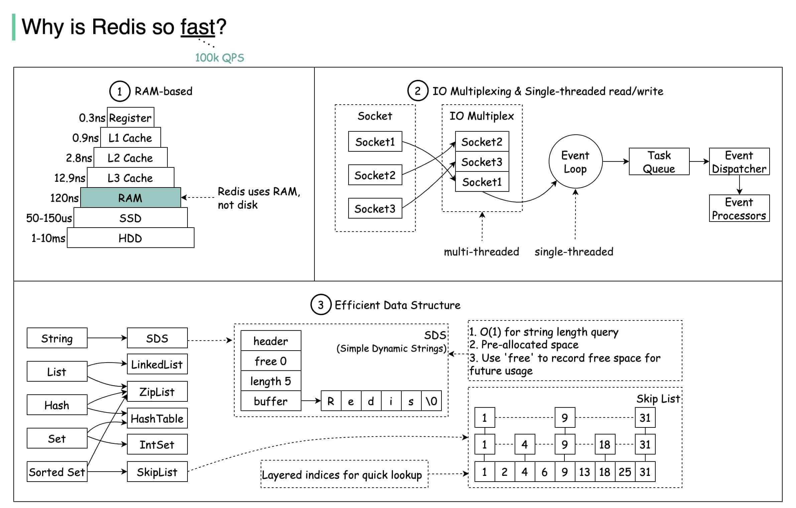

# Redis

## Redis 基础

### Redis 为什么那么快？
- 纯内存操作
- 高效的I/O模型
  - 使用单线程事件循环配合I/O多路复用技术，让单个线程可以同时处理多个儿网络连接上的I/O事件
- 优化的内部数据结构
- 简洁高效的通信协议



### Redis 的有序集合底层为什么要用跳表，而不用平衡树、红黑树或者 B+树？

当有序集合对象(ZSet)同时满足下面两个条件时，使用 `ziplist`:
- ZSet 保存的键值对数量少于 128 个
- 每个元素的长度小于 64 字节

如果不满足上述两个条件，那么使用 `skiplist`。

假设元素个数为`n`，那么对应 `k` 层索引的元素个数 `n_k` 计算公式为:
```
n_k = n / 2^k
```

#### 平衡树 vs 跳表
平衡树(AVL)的插入、删除、查询操作时间复杂度均为 `O(logN)`

> 跳表是一种可以用来代替平衡树的数据结构。跳表使用概率平衡而不是严格强制的平衡，因此，跳表中的插入和删除算法比平衡树的等效算法简单得多，速度也快得多。

跳表的插入、删除、查询的操作时间复杂度也为 `O(logN)`

#### 红黑树 vs 跳表
红黑树的查询性能略逊色于 AVL, 但插入、删除操作的性能更高；
红黑树的插入、删除和查询的时间复杂度和跳表一样都是 `O(log n)`

#### B+树 vs 跳表

B+树的特点：
- 多叉树结构：它是一棵多叉树，每个节点可以包含多个子节点，减小了树的高度，查询效率高。
- 存储效率高:其中非叶子节点存储多个 key，叶子节点存储 value，使得每个节点更够存储更多的键，根据索引进行范围查询时查询效率更高。
- 平衡性：它是绝对的平衡，即树的各个分支高度相差不大，确保查询和插入时间复杂度为 O(log n) 。
- 顺序访问：叶子节点间通过链表指针相连，范围查询表现出色。
- 数据均匀分布：B+树插入时可能会导致数据重新分布，使得数据在整棵树分布更加均匀，保证范围查询和删除效率。

所以，B+树更适合作为数据库和文件系统中常用的索引结构之一，它的核心思想是通过可能少的 IO 定位到尽可能多的索引来获得查询数据。
对于 Redis 这种内存数据库来说，它对这些并不感冒，因为 Redis 作为内存数据库它不可能存储大量的数据，所以对于索引不需要通过 B+树这种方式进行维护，只需按照概率进行随机维护即可，节约内存。

#### Redis 作者自己的理由
```
有几个原因：
1、它们不是很占用内存。这主要取决于你。改变节点拥有给定层数的概率的参数，会使它们比 B 树更节省内存。
2、有序集合经常是许多 ZRANGE 或 ZREVRANGE 操作的目标，也就是说，以链表的方式遍历跳表。通过这种操作，跳表的缓存局部性至少和其他类型的平衡树一样好。
3、它们更容易实现、调试等等。例如，由于跳表的简单性，我收到了一个补丁（已经在 Redis 主分支中），用增强的跳表实现了 O(log(N))的 ZRANK。
```


## Redis 持久化机制
- 快照(RDB, Redis Database)
- 只追加文件(AOF, Append Only File)
- RDB + AOF: 混合使用

### RDB 持久化
核心逻辑：在指定的间隔时间内，将 Redis 内存中的全量数据生成一个二进制快照文件(.rdb)，保存到磁盘。

RDB 创造快照是否会阻塞主线程？
有两种方式：
- `save`: 同步保存操作，会阻塞 `Redis`主线程(Redis 是单线程)
- `bgsave`: fork 出一个子进程，子进程执行，不会阻塞 Redis 主线程，默认选项。

### AOF 持久化
核心逻辑：以 “追加日志” 的方式，记录 Redis 执行的所有写命令（如 SET、HSET、SETBIT 等），重启时通过重新执行这些命令恢复数据。

与 RDB 相比，AOF持久化的实时性更好。
AOF 默认并不开启(6.0以后默认开启), 可以通过命令 `appendonly yes`开启。

开启 AOF 后每执行一条更改 Redis 数据的命令，Redis 都会将该命令写入 AOF 缓冲区中

### AOF重点逻辑: 刷盘策略
- 每条命令进行刷盘
- 每秒刷盘
- 由操作系统决定刷盘时机，性能最好，但可能丢失数据。
```
# appendfsync always  # 每写1条命令刷盘，最安全但性能最差
appendfsync everysec # 每秒刷盘，平衡性能和安全性（推荐）
# appendfsync no      # 由操作系统决定刷盘时机，性能最好但数据丢失风险高
```

### AOF重点逻辑：AOF 重写
AOF 运行一段时间后会产生大量冗余命令（比如多次修改同一个键），需执行 `BGREWRITEAOF`（后台重写）压缩日志：
重写后，AOF 文件会只保留 “恢复数据所需的最小命令集”（比如一个键被修改 100 次，重写后仅保留最终的 SET 命令）。

### RDB 和 AOF 同时开启，重启时优先用哪个？
优先用 AOF

### fork 子进程会阻塞主进程吗？
fork 过程会短暂阻塞主进程，数据量越大，阻塞时间越长。因此尽量在低峰期执行 `BGSAVE/BGREWRITEAOF`

### 为什么 AOF 是执行完命令再记录？
而 MySQL 的 redo log 是执行命令前先记录，这是为什么呢？

好处：
- 避免额外的检查开销，AOF 记录日志不会对命令进行语法检查
- 在执行完命令后再记录，不会阻塞当前命令的执行
- Redis 的操作是内存修改，具备原子性，执行成功再记录性能更高，事务失败也不需要回滚。

风险：
- 如果刚执行完命令，Redis 就宕机，那么数据就会丢失；
- 可能会阻塞后续其他命令的执行

## Redis 线程模型

### Redis 单线程模型
基于 `Reactor` 模式设计开发了一套高效的事件处理机制。

```
多个socket(客户端连接) -> I/O多路复用 -> 文件事件处理器(file event handler) -> 事件处理器
```

Redis 6.0 之前为什么只用单线程模型:
- 单线程编程容易并且更容易维护；
- Redis 的性能瓶颈不在 CPU，主要在内存和网络；
- 多线程就会存在死锁、线程上下文切换等问题，甚至会影响性能。

### 6.0之后引入多线程

主要是为了处理网络`I/O`读写性能，这部分是 Redis 的性能瓶颈。(默认是禁用多线程的, 性能提升不高)

## Redis 内存管理
为什么一般情况下会给缓存数据设置过期时间：
- 因为内存珍贵，如果没有过期时间，内存可能会越来越大，直到 OOM
- 业务需要，有些数据就是只在一段时间内生效，比如 token

### Redis 是如何判断数据是否过期的？
- TTL/PTTL命令，TTL 是秒级，PTTL 是毫秒级
- 存在数据过期字典(key: 数据, value: long long 类型的时间戳)
- 先查过期字典，如果存在就判断是否过期，过期会删除后返回 null

### Redis 过期删除策略
- 惰性删除：查询时发现过期了才执行删除(CPU友好，内存不友好)
- 定期删除：周期性抽查，删除过期 key, 如果过期比例高，则继续抽查下一批，避免单次检查耗时过长。(内存友好，CPU 不友好)
- 内存淘汰策略: 内存不足时，根据内存淘汰策略删除key
  - volatile-lru: 设置了过期时间的键中-删除最少使用的键
  - volatile-ttl: 设置了过期时间的键中-删除剩余过期时间最少的键
  - volatile-random: 设置了过期时间的键中-随机删除
  - allkeys-lru: 从所有键中-删除最近最少使用的键(lru)
  - allkeys-random: 从所有键中-随机删除
